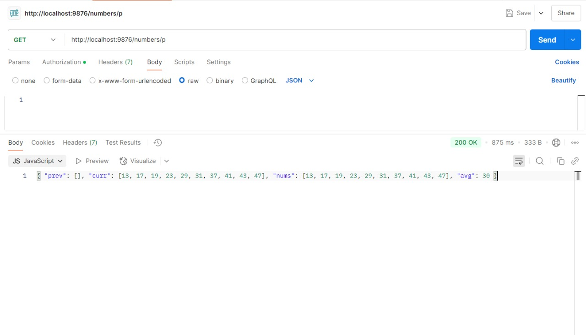
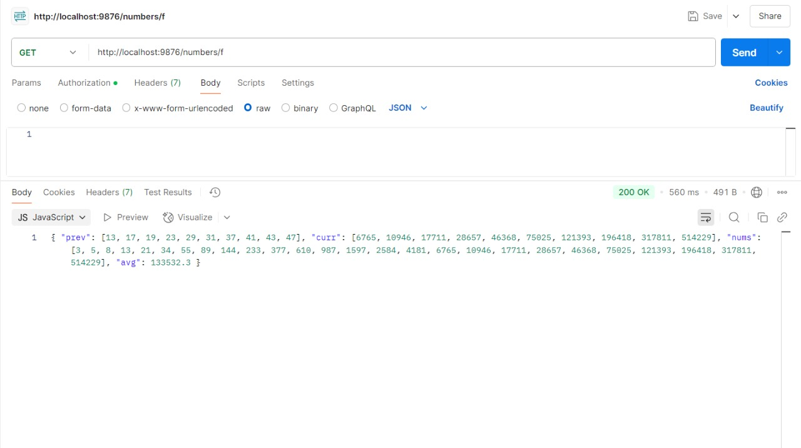
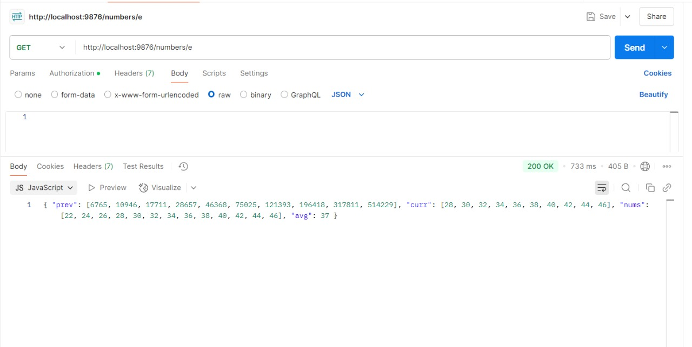
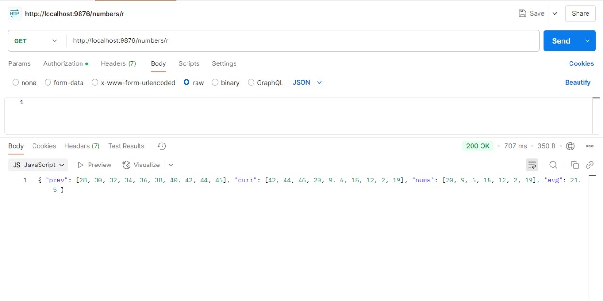

---

# Average-Calculator

A Node.js application that fetches numbers from an external API and calculates the average of the most recent 10 numbers. It uses an in-memory sliding window to keep track of the latest numbers and responds with the current and previous window states along with the average.

## Features

* Fetch numbers from an external API.
* Maintain a sliding window of the last 10 unique numbers.
* Calculate the average of the numbers in the sliding window.
* Handle API timeouts or errors gracefully.
* Expose a REST API endpoint to interact with the application.

## Technologies Used

* **Node.js**: JavaScript runtime environment.
* **Express.js**: Web framework for Node.js.
* **Axios**: Promise-based HTTP client to make API requests.
* **In-memory Sliding Window**: Stores the latest unique numbers and calculates their average.

## Installation

1. Clone the repository:

   ```bash
   git clone https://github.com/your-username/average-calculator.git
   ```

2. Navigate to the project directory:

   ```bash
   cd average-calculator
   ```

3. Install dependencies:

   ```bash
   npm install
   ```

4. Run the server:

   ```bash
   node app.js
   ```

   The server will be running on `http://localhost:9876`.

## API Usage

### Endpoint: `/numbers/:id`

This endpoint accepts the following `id` values:

* `p` for primes
* `f` for Fibonacci numbers
* `e` for even numbers
* `r` for random numbers

### 📸 Example Requests & Responses

To fetch prime numbers:  
`GET http://localhost:9876/numbers/p`  


To fetch Fibonacci numbers:  
`GET http://localhost:9876/numbers/f`  


To fetch even numbers:  
`GET http://localhost:9876/numbers/e`  


To fetch random numbers:  
`GET http://localhost:9876/numbers/r`  



## Error Handling

* **400 Bad Request**: If an invalid `id` is provided.
* **500 Internal Server Error**: If there's an issue with the API request or server.

## License

This project is licensed under the MIT License - see the [LICENSE](LICENSE) file for details.

---
